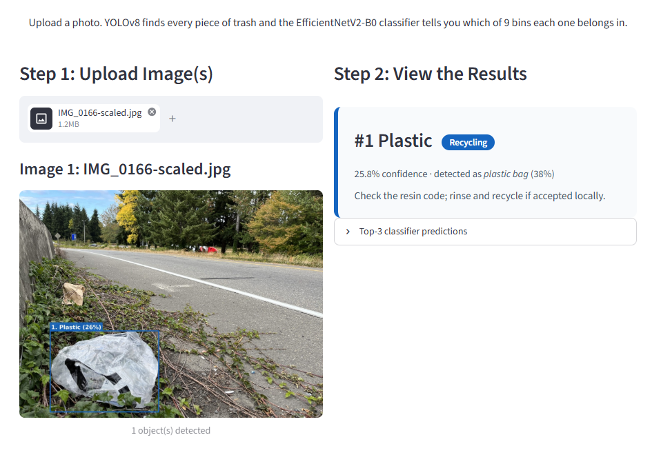

# LitterBot AI (waste classification)

> This repo is the computer-vision and waste-classification system of **LitterBot**, an
> award-winning autonomous sorting robot (Diamond Challenge finalist; DSWA Innovation
> Award). It covers the machine-learning pipeline only: YOLOv8 object detection feeding an
> EfficientNetV2-B0 classifier that sorts each item into 9 waste categories. The robotics
> and hardware live in a separate project.

**Live demo:** [apps.leonzhao.dev/litterbot](https://apps.leonzhao.dev/litterbot/) (always on, no cold start)

Featured in context at [leonzhao.dev/ai/litterbot](https://leonzhao.dev/ai/litterbot/).



## The approach

Two stages run per uploaded photo:

1. **Detection.** A YOLOv8n model proposes bounding boxes for every distinct object in the
   image (class-agnostic for our purposes; obvious non-trash like people is filtered out).
   If it finds nothing, the whole image is classified instead.
2. **Classification.** Each detected crop is passed to an **EfficientNetV2-B0** classifier
   (exported to TFLite) trained on the 9 categories of the
   [RealWaste](https://www.kaggle.com/datasets/joebeachcapital/realwaste) dataset:
   Cardboard, Food Organics, Glass, Metal, Miscellaneous Trash, Paper, Plastic,
   Textile Trash, and Vegetation.

The app then draws color-coded boxes (recycle / compost / landfill / donate) and gives a
per-item disposal tip.

Using TFLite for the classifier keeps the runtime light enough to install and serve on a
standard CPU host.

## Results

| Metric | Value |
|---|---|
| Categories | **9** (RealWaste) |
| Classifier | EfficientNetV2-B0 (TFLite) |
| Validation accuracy | **87.6%** |
| Detector | YOLOv8n (Ultralytics) |

## Run it locally

```bash
pip install -r requirements.txt
# CPU-only torch (skip the ~2GB CUDA build) if you don't have a GPU:
# pip install --index-url https://download.pytorch.org/whl/cpu torch torchvision
streamlit run app.py
```

Then open the URL Streamlit prints (default http://localhost:8501) and upload a photo.

## Training notebook

The classifier was trained in [`notebooks/training.ipynb`](notebooks/training.ipynb)
(RealWaste dataset, downloaded via `kagglehub`).

## License

This project is licensed under [AGPL-3.0](LICENSE), inherited from its use of
Ultralytics YOLOv8.
